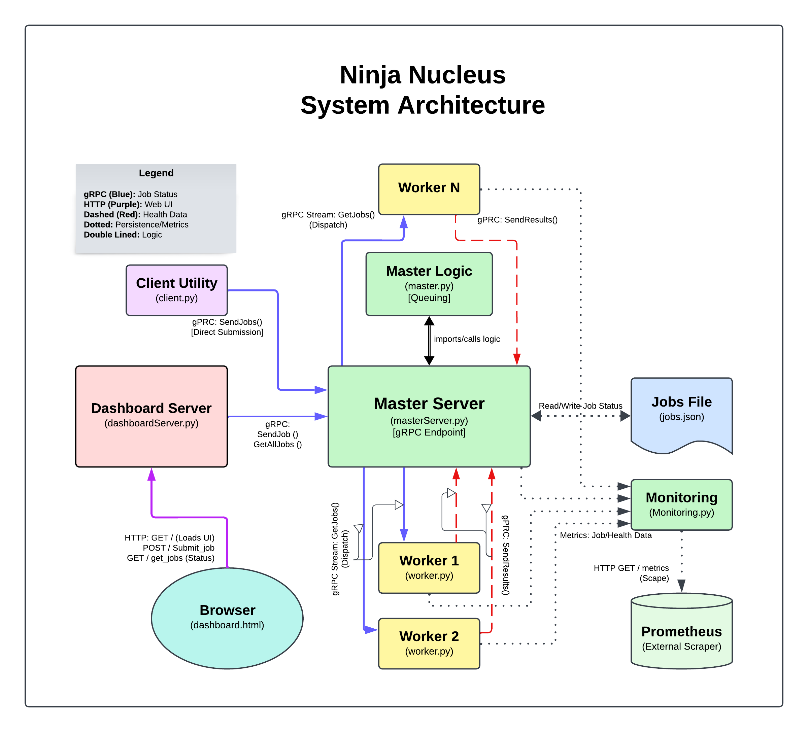

# Ninja-Nucleus: A Scalable Distributed Job Queuing System

Ninja-Nucleus is a robust, scalable prototype for a distributed job queue and processing system. It leverages the performance of **gRPC** for efficient inter-service communication and implements a modern **Prometheus monitoring stack** for real-time observability and fault detection.

This system is designed to demonstrate key distributed computing patterns: Master-Worker orchestration, server-streaming job distribution, robust worker heartbeat monitoring, and dedicated metrics collection.

## 🚀 Architectural Blueprint

The architecture separates core job management (Master) from task execution (Worker) and status visibility (Monitoring/Dashboard).



| Component | Technology | Role | Communication |
| :---- | :---- | :---- | :---- |
| **Master Service** (`masterServer.py`) | gRPC Server (Python) | **Orchestration Hub.** Manages the central job queue, handles worker registration, and **pushes** job status metrics (QUEUED, COMPLETED, FAILED). | gRPC (Workers/Dashboard), **HTTP POST (Metrics)** |
| **Worker Nodes** (`Worker.py`) | gRPC Client (Python) | **Execution Engine.** Executes tasks and **pushes** heartbeats/status metrics every 3 seconds. | gRPC (Master), **HTTP POST (Heartbeats/Metrics)** |
| **Dashboard Server** (`dashboardServer.py`) | HTTP Server (Flask) | **API Gateway.** Translates user HTTP requests from the UI into gRPC commands for the Master. | HTTP/REST (Web Client), gRPC (Master) |
| **Monitoring Server** (`monitoring.py`) | HTTP Server (Python) | **Metrics Collector.** Aggregates metrics pushed by the system and exposes them on a dedicated endpoint for Prometheus. | HTTP POST (Push), **HTTP GET (Pull/Scrape)** |
| **Prometheus** | External TSDB (Cylinder) | **Persistent Storage.** Periodically scrapes metrics from the Monitoring Server for long-term storage and querying. | **HTTP GET (Monitoring Server)** |

## 🛠️ Installation and Setup

### Prerequisites

1.  **Python 3.x**
2.  **pip** (Python package installer)
3.  **Graphviz** (`dot` command-line tool) for generating the architecture diagram.
4.  **Prometheus** (Required for the full monitoring setup).
5.  **Grafana** (Highly recommended for metric visualization).
6.  **Docker** (Required for containerization/deployment).

### Installation Steps

1.  **Install Python Dependencies:**
    This command installs `grpcio` for communication, `requests` for the metrics push, `prometheus_client` for exposition, and `Flask` for the dashboard.

    ```bash
    pip install grpcio grpcio-tools requests prometheus_client flask
    ```

2.  **Generate gRPC Stubs:**
    You must compile the `.proto` file (e.g., `job_queue.proto`) to generate the Python stub files (`job_queue_pb2.py` and `job_queue_pb2_grpc.py`).

    ```bash
    python -m grpc_tools.protoc -I. --python_out=. --grpc_python_out=. job_queue.proto
    ```

## 🏃 Running the System

The recommended launch order is Monitoring $\rightarrow$ Master $\rightarrow$ Worker $\rightarrow$ Dashboard.

### 1\. Start the Monitoring Server

The dedicated metrics endpoint must be available first.

```bash
python3 monitoring.py
```

  * Status: Internal metrics updates listening on **port 8000**; Prometheus scrape endpoint on **port 8001/metrics**.

### 2\. Start the Master Server

The core of the system, managing the job queue.

```bash
python3 masterServer.py
```

  * Status: gRPC Master listening on **port 50051**.

### 3\. Start Worker Nodes

Launch one or more instances to execute jobs.

```bash
python3 Worker.py
```

  * Status: Workers are connected to the Master and polling for jobs. They are sending heartbeats via HTTP POST to the Monitoring Server (port 8000).

### 4\. Launch the Dashboard

For web-based job submission and status viewing.

```bash
python3 dashboardServer.py
```

  * Status: HTTP Dashboard available at `http://localhost:5000`.

## 🌐 API Endpoints and Interfaces

### Dashboard HTTP API (REST)

The `dashboardServer.py` exposes two primary REST endpoints for user interaction, which internally translate to gRPC calls to the Master.

| Endpoint | Method | Description | Request Body (JSON) | Response Body (JSON) |
| :---- | :---- | :---- | :---- | :---- |
| `/submit_job` | `POST` | Submits a new job to the queue. | `{"job_type": "Fibonacci", "payload": 30}` | `{"success": true, "job_id": "..."}` |
| `/get_all_jobs` | `GET` | Retrieves the status and result of every job processed by the system. | *(None)* | `{"success": true, "jobs": {...}}` |

### Master gRPC Service Interface

The `JobQueueService` is the core interface, defined in `job_queue.proto`.

| RPC Method | Type | Description |
| :---- | :---- | :---- |
| `SendJob` | Unary | Used by the Dashboard to submit a job request to the Master. |
| `GetJobs` | Server Stream | Used by Workers to continuously receive new jobs from the Master queue. |
| `SendResult` | Unary | Used by Workers to report the successful or failed execution result back to the Master. |
| `Heartbeat` | Unary | Used by Workers to periodically signal liveness to the Master. |
| `GetAllJobs` | Unary | Used by the Dashboard to query the full state of the job ledger. |

## ⚙️ Job Execution Logic (`Worker.py`)

The `Worker.py` script contains the `execute_job` function, which simulates the actual workload.

  * **Job Type:** Currently, the system supports the `"Fibonacci"` job type.
  * **Payload:** The payload must be an **integer**, representing the index $n$ for which the $n$-th Fibonacci number is calculated.
  * **Workload Simulation:** The Fibonacci calculation acts as a CPU-bound task, allowing you to observe job processing times, queue backlog, and worker utilization in Prometheus/Grafana.

### Fault Tolerance

The **Master Service** implements a robust fault-tolerance mechanism:

1.  Workers send **gRPC Heartbeats** to the Master every **3 seconds**.
2.  The Master's internal monitor checks if a heartbeat is older than **10 seconds** (`WORKER_TIMEOUT`).
3.  If a worker times out, any job it was processing is automatically **re-queued** to the front of the queue, ensuring no job is lost due to transient worker failure.

## 📊 Observability with Prometheus

The system uses a **Push/Pull** model for metrics, where the core components **push** ephemeral status updates to the centralized `monitoring.py` server, and **Prometheus pulls** the current state for persistence.

### Prometheus Configuration

You must configure your Prometheus instance (typically via `prometheus.yml`) to scrape the metrics server on port `8001`.

```yaml
# prometheus.yml snippet
scrape_configs:
  # This job scrapes the metrics endpoint exposed by monitoring.py
  - job_name: 'ninja_nucleus_metrics'
    # Define the scrape interval (how often Prometheus pulls data)
    scrape_interval: 5s
    # The list of targets to scrape
    static_configs:
      - targets: ['localhost:8001']
```

-----

## 🤝 Contributing

We welcome contributions to Ninja-Nucleus\! To ensure a smooth process, please follow these guidelines:

### Reporting Bugs

If you find a bug, please open an issue with the following details:

1.  A clear, descriptive title summarizing the problem.
2.  Steps to reproduce the bug (including commands run and expected output).
3.  Your environment details (Python version, OS, etc.).

### Development Setup

1.  Fork the repository.
2.  Create your feature branch: `git checkout -b feature/amazing-new-feature`
3.  Install development dependencies (if any).
4.  Ensure all local services start correctly using the steps in **Running the System**.
5.  Commit your changes following the conventional commit format (e.g., `feat: add exponential backoff to worker`).
6.  Open a Pull Request with a clear summary of your changes.

### Testing and Quality

Before submitting a Pull Request, ensure all services start correctly and communication flows are maintained. Key quality checks:

  * **Flow Check:** Job submission and result reporting are successful.
  * **Metrics Check:** Verify heartbeats and job status metrics are correctly exposed on the Prometheus endpoint.
  * **Code Style:** All Python code must adhere to PEP 8 guidelines.

-----

## ⚖️ License

This project is licensed under the **MIT License**.

A short summary of the license terms:

  * **Permitted Use:** Commercial use, modification, distribution, and private use.
  * **Conditions:** Must include the license and copyright notice with the software.
  * **Limitations:** Liability and warranty are excluded.

See the separate `LICENSE.md` file for the full text.

-----

## 📦 Containerization and Deployment

For true production readiness, all services should be run inside containers. This ensures environment consistency and simplifies deployment via Docker Compose or Kubernetes.

### Building Docker Images

A generic `Dockerfile` can be used for the Python services (`masterServer.py`, `Worker.py`, `monitoring.py`, `dashboardServer.py`).

**Example `Dockerfile`:**

```dockerfile
# Use a Python base image
FROM python:3.11-slim

# Set the working directory
WORKDIR /app

# Copy dependency files and install requirements
COPY requirements.txt .
RUN pip install --no-cache-dir -r requirements.txt

# Copy the rest of the application source code
COPY . .

# Compile gRPC stubs inside the container for consistency (requires job_queue.proto)
RUN python -m grpc_tools.protoc -I. --python_out=. --grpc_python_out=. job_queue.proto

# Default command to run (e.g., masterServer)
CMD ["python3", "masterServer.py"]
```

### Deployment Strategy

To run the entire system, you would use a **Docker Compose** file (`docker-compose.yml`) that defines:

1.  **`master`** service (using the image built above).
2.  **`worker1`, `worker2`, ...** services (using the image built above, scaling factor $N$).
3.  **`monitoring`** service (using the image built above).
4.  **`dashboard`** service (using the image built above).
5.  **`prometheus`** service (using the standard Prometheus Docker image, mounted with the `prometheus.yml` configuration).
6.  **`grafana`** service (for visualization).

This containerization approach ensures that the entire distributed system can be launched with a single command: `docker-compose up -d`.
